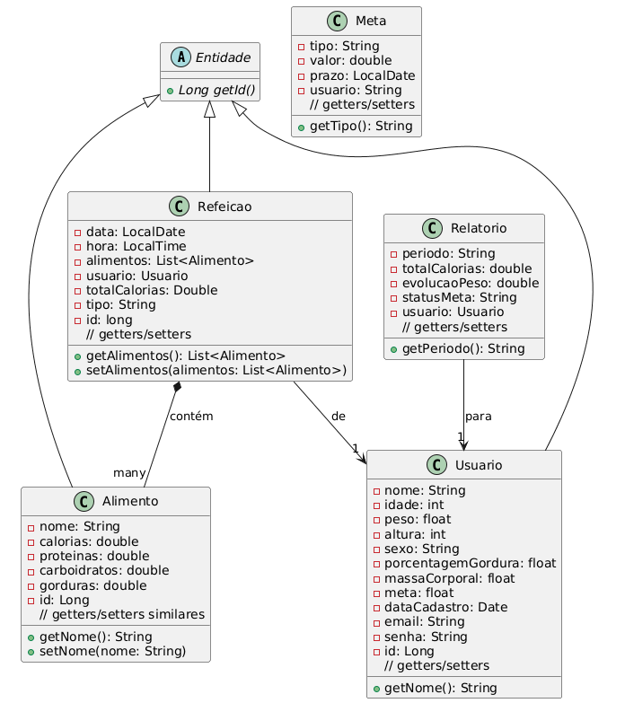
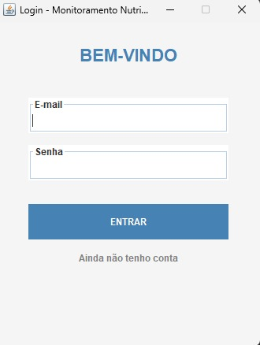
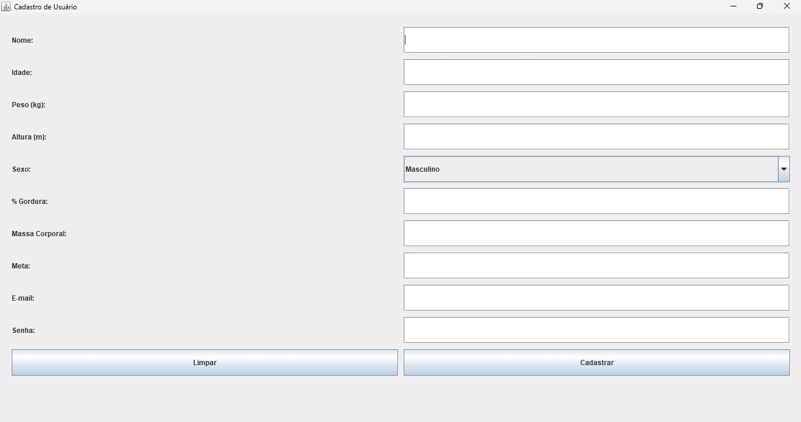
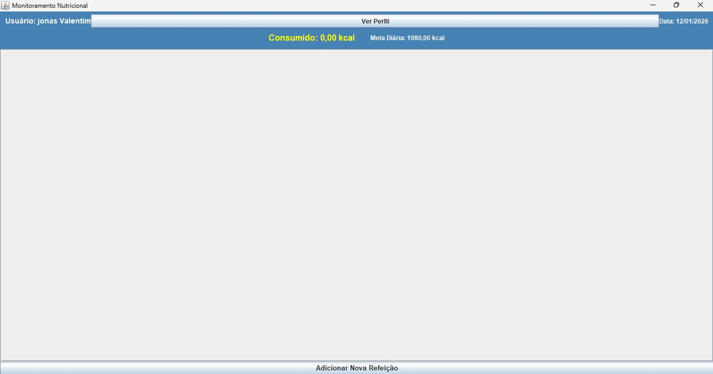
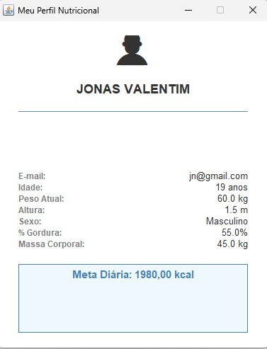
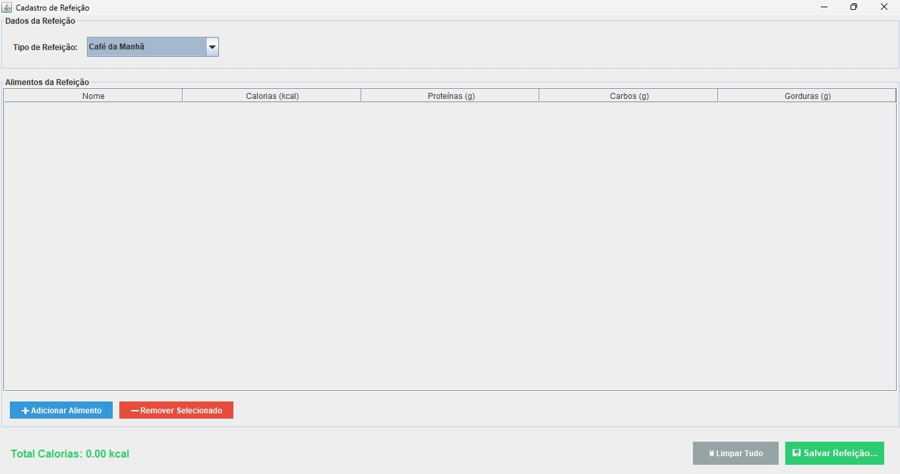

# 📊 Sistema de Monitoramento Nutricional


Sistema desktop desenvolvido em Java para monitoramento e controle nutricional completo, permitindo que usuários registrem suas refeições, acompanhem o consumo calórico diário e gerenciem metas de saúde de forma intuitiva e eficiente.

---

## 📑 Índice

- [Linguagem Usada](#-linguagem-usada)
- [Banco de Dados](#️-banco-de-dados)
- [Motivo da Escolha do Banco](#-motivo-da-escolha-do-banco)
- [Interface Gráfica](#-interface-gráfica)
- [Arquitetura](#️-arquitetura)
- [Pacote Model (Entidades)](#-pacote-model-entidades)
- [Pacote DAO (Persistência)](#-pacote-dao-persistência)
- [Pacote View (Telas Swing)](#️-pacote-view-telas-swing)
- [Diagrama de Classes](#-diagrama-de-classes)
- [Capturas de Tela do Sistema](#-capturas-de-tela-do-sistema)
- [Como Executar o Projeto](#-como-executar-o-projeto)

---

## 💻 Linguagem Usada

### **Java SE 8+**

O projeto foi desenvolvido utilizando **Java Standard Edition 8 ou superior**, aproveitando todos os recursos da Programação Orientada a Objetos (POO) e boas práticas de desenvolvimento.

#### Recursos Java Utilizados

**🔹 Programação Orientada a Objetos**
- **Encapsulamento**: Proteção de dados através de modificadores de acesso (private, public)
- **Herança**: Classe abstrata `Entidade` sendo base para todas as entidades do domínio
- **Polimorfismo**: Métodos sobrescritos nas classes filhas
- **Abstração**: Interfaces e classes abstratas para definição de contratos

**🔹 Collections Framework**
- `List<Alimento>` para gerenciar múltiplos alimentos em uma refeição
- `ArrayList` para manipulação dinâmica de listas

**🔹 Java Time API**
- `LocalDate` para manipulação de datas
- `LocalTime` para registro de horários das refeições
- `Date` para compatibilidade com JDBC

**🔹 JDBC (Java Database Connectivity)**
- `Connection`, `PreparedStatement`, `ResultSet` para interação com banco de dados
- Try-with-resources para gerenciamento automático de recursos
- Tratamento de exceções SQL

**🔹 Java Swing**
- Framework nativo para criação de interfaces gráficas desktop
- Componentes visuais: `JFrame`, `JPanel`, `JButton`, `JTextField`, etc.
- Listeners para eventos de usuário

#### Paradigmas e Padrões Aplicados

- **MVC (Model-View-Controller)**: Separação clara de responsabilidades
- **DAO (Data Access Object)**: Isolamento da lógica de persistência
- **Factory Pattern**: `ConnectionFactory` para criação de conexões
- **Single Responsibility**: Cada classe com responsabilidade única e bem definida

---

## 🗄️ Banco de Dados

### **H2 Database Engine v2.4.240**

O sistema utiliza o **H2 Database**, um banco de dados relacional embarcado escrito em Java, que armazena os dados localmente em arquivos no diretório `./database/`.

#### Características do H2

- **Tipo**: Banco de dados relacional SQL
- **Modo**: Arquivo persistente (`jdbc:h2:./database/projeto_db`)
- **Engine**: Embarcado (embedded)
- **Tamanho**: Aproximadamente 2.6 MB (biblioteca JAR)
- **Suporte**: SQL-92, transações ACID, índices, foreign keys

### 📊 Modelo de Dados

O banco possui **6 tabelas principais** organizadas em um modelo relacional normalizado:

#### 1. **usuario**
```sql
CREATE TABLE usuario (
    id BIGINT AUTO_INCREMENT PRIMARY KEY,
    nome VARCHAR(255) NOT NULL,
    idade INT NOT NULL,
    peso DOUBLE NOT NULL,
    altura DOUBLE NOT NULL,
    sexo VARCHAR(20),
    porcentagem_gordura DOUBLE,
    massa_corporal DOUBLE,
    meta VARCHAR(100),
    data_cadastro DATE NOT NULL DEFAULT CURRENT_DATE,
    email VARCHAR(150) UNIQUE NOT NULL,
    senha VARCHAR(255) NOT NULL
);
```
**Armazena**: Dados cadastrais e métricas corporais dos usuários

#### 2. **alimento**
```sql
CREATE TABLE alimento (
    id BIGINT AUTO_INCREMENT PRIMARY KEY,
    nome VARCHAR(255) NOT NULL,
    calorias DOUBLE NOT NULL,
    proteinas DOUBLE NOT NULL,
    carboidratos DOUBLE NOT NULL,
    gorduras DOUBLE NOT NULL
);
```
**Armazena**: Catálogo de alimentos com informações nutricionais

#### 3. **refeicao**
```sql
CREATE TABLE refeicao (
    id BIGINT AUTO_INCREMENT PRIMARY KEY,
    data_registro DATE NOT NULL,
    hora_registro TIME NOT NULL,
    usuario_id BIGINT NOT NULL,
    total_calorias DOUBLE NOT NULL,
    tipo VARCHAR(20) NOT NULL
);
```
**Armazena**: Registro de refeições realizadas pelos usuários

#### 4. **refeicao_alimentos** (Tabela Associativa)
```sql
CREATE TABLE refeicao_alimentos (
    refeicao_id BIGINT NOT NULL,
    alimento_id BIGINT NOT NULL,
    FOREIGN KEY (refeicao_id) REFERENCES refeicao(id),
    FOREIGN KEY (alimento_id) REFERENCES alimento(id)
);
```
**Armazena**: Relacionamento N:N entre refeições e alimentos

#### 5. **meta**
```sql
CREATE TABLE meta (
    id BIGINT AUTO_INCREMENT PRIMARY KEY,
    tipo VARCHAR(50) NOT NULL,
    valor DOUBLE NOT NULL,
    prazo DATE NOT NULL,
    usuario_id BIGINT NOT NULL,
    FOREIGN KEY (usuario_id) REFERENCES usuario(id)
);
```
**Armazena**: Metas nutricionais definidas pelos usuários

#### 6. **relatorio**
```sql
CREATE TABLE relatorio (
    id BIGINT AUTO_INCREMENT PRIMARY KEY,
    total_calorias DOUBLE NOT NULL,
    evolucao_peso DOUBLE NOT NULL,
    status_meta VARCHAR(100),
    usuario_id BIGINT NOT NULL,
    FOREIGN KEY (usuario_id) REFERENCES usuario(id)
);
```
**Armazena**: Relatórios de acompanhamento e evolução nutricional

### 🔗 Relacionamentos

- **Usuario ↔ Refeicao**: 1:N (Um usuário possui várias refeições)
- **Usuario ↔ Meta**: 1:N (Um usuário pode ter várias metas)
- **Usuario ↔ Relatorio**: 1:N (Um usuário possui vários relatórios)
- **Refeicao ↔ Alimento**: N:N (Uma refeição contém vários alimentos, um alimento pode estar em várias refeições)

---

## ✅ Motivo da Escolha do Banco

A escolha do **H2 Database** foi estratégica e fundamentada em diversas vantagens técnicas e práticas:

### 🎯 Razões Principais

#### 1. **Zero Configuração e Deploy Simplificado**
- Não requer instalação externa ou servidor dedicado
- Todo o banco de dados roda dentro da própria aplicação Java
- Ideal para aplicações desktop que precisam de portabilidade
- Usuário final não precisa instalar ou configurar nada além da aplicação

#### 2. **Portabilidade Total**
- Banco de dados armazenado em arquivos locais simples
- Fácil distribuição: basta copiar a pasta `database/`
- Backup simplificado: apenas copiar os arquivos `.mv.db`
- Possibilidade de sincronização via cloud storage (Dropbox, Google Drive)

#### 3. **Desenvolvimento Ágil**
- Inicialização instantânea sem necessidade de servidor rodando
- Ideal para prototipagem rápida
- Permite foco total na lógica de negócio sem perder tempo com configurações
- Console web integrado para testes e debug

#### 4. **Compatibilidade Perfeita com Java**
- Escrito 100% em Java, garantindo compatibilidade total
- Integração nativa com JDBC
- Suporte completo a tipos de dados Java
- Não há problemas de compatibilidade entre sistemas operacionais

#### 5. **Performance Adequada**
- Suficientemente rápido para aplicações de uso pessoal
- Consultas executadas em memória quando necessário
- Índices automáticos para otimização
- Adequado para dezenas de milhares de registros

#### 6. **Inicialização Automática do Schema**
- Parâmetro `INIT=RUNSCRIPT` executa automaticamente o SQL de criação
- Garante que as tabelas existam na primeira execução
- Elimina necessidade de scripts de instalação manuais
- Desenvolvedor não precisa se preocupar com estado inicial do banco

#### 7. **Modo Arquivo com Persistência**
- Configurado como `jdbc:h2:./database/projeto_db` (modo arquivo)
- Dados persistem entre execuções da aplicação
- Diferente do modo memória que perde dados ao fechar
- Ideal para aplicação desktop de uso contínuo

#### 8. **Curva de Aprendizado Baixa**
- Sintaxe SQL padrão (SQL-92)
- Documentação completa e exemplos abundantes
- Fácil para estudantes aprenderem JDBC
- Transição suave para bancos corporativos posteriormente

### 🚀 Alternativas Consideradas

| Banco de Dados | Por Que Não Foi Escolhido |
|----------------|---------------------------|
| **MySQL/PostgreSQL** | Requer instalação e configuração de servidor, complexo para usuário final |
| **SQLite** | Menor suporte a SQL avançado, sem tipos Java nativos |
| **Oracle/SQL Server** | Licenças pagas, peso excessivo para aplicação acadêmica |
| **MongoDB** | NoSQL não era requisito, complexidade desnecessária |
| **Derby** | Menos performático que H2, comunidade menor |

---

## 🎨 Interface Gráfica

### **Java Swing Framework**

A interface gráfica foi desenvolvida utilizando **Java Swing**, a biblioteca padrão do Java para criação de interfaces desktop ricas e interativas.

### 🖌️ Características Visuais

#### Design System

**Paleta de Cores Principal**:
- Azul Primário: `#4682B4` (SteelBlue) - Botões e headers
- Azul Escuro: `#2C5F8D` - Hover states
- Fundo Claro: `#F5F5F5` (WhiteSmoke) - Background
- Branco: `#FFFFFF` - Cards e painéis
- Texto Escuro: `#333333` - Textos principais
- Verde Sucesso: `#4CAF50` - Ações positivas
- Vermelho Erro: `#F44336` - Ações negativas
- Amarelo Info: `#FFD700` - Informações calóricas

**Tipografia**:
- Títulos Principais: Arial Bold 22pt
- Subtítulos: Arial Bold 16pt
- Texto Normal: Arial Regular 14pt
- Labels: Arial 12pt

### 📱 Componentes Swing Utilizados

#### Containers
- **JFrame**: Janelas principais da aplicação
- **JPanel**: Painéis para organização de layouts
- **JScrollPane**: Áreas roláveis para tabelas e listas

#### Inputs
- **JTextField**: Campos de texto simples
- **JPasswordField**: Campos de senha com caracteres ocultos
- **JComboBox**: Listas suspensas (dropdown)

#### Outputs
- **JLabel**: Rótulos e textos informativos
- **JTable**: Tabelas para exibição de dados

#### Ações
- **JButton**: Botões de ação

### 🎭 Layouts Managers

- **BoxLayout**: Organização vertical/horizontal simples
- **BorderLayout**: Divisão em 5 regiões (North, South, East, West, Center)
- **GridLayout**: Grade de componentes uniformes

---

## 🏗️ Arquitetura

O projeto segue uma **arquitetura em camadas** baseada no padrão **MVC (Model-View-Controller)** com a adição da camada **DAO (Data Access Object)**.

### 📦 Estrutura de Pacotes

```
br.com.projeto_poo/
│
├── 📁 model/           → Entidades de domínio (POJO)
│   ├── Entidade.java        (Classe abstrata base)
│   ├── Usuario.java
│   ├── Alimento.java
│   ├── Refeicao.java
│   ├── Meta.java
│   └── Relatorio.java
│
├── 📁 view/            → Interface gráfica (Swing)
│   ├── TelaLogin.java
│   ├── TelaCadastroUsuario.java
│   ├── TelaCadastroRefeicao.java
│   ├── TelaMonitoramento.java
│   └── TelaPerfil.java
│
├── 📁 controller/      → Lógica de negócio e validação
│   ├── UsuarioController.java
│   ├── RefeicaoController.java
│   └── MonitoramentoController.java
│
├── 📁 dao/             → Acesso a dados (CRUD)
│   ├── UsuarioDAO.java
│   ├── AlimentoDAO.java
│   ├── RefeicaoDAO.java
│   └── MonitoramentoDAO.java
│
└── 📁 util/            → Classes utilitárias
    ├── ConnectionFactory.java
    └── ConnectionH2.java
```

### 🔄 Fluxo de Dados

```
┌─────────┐      ┌────────────┐      ┌─────────┐      ┌──────────┐
│  VIEW   │ ───► │ CONTROLLER │ ───► │   DAO   │ ───► │ DATABASE │
│ (Swing) │      │  (Lógica)  │      │ (JDBC)  │      │   (H2)   │
└─────────┘      └────────────┘      └─────────┘      └──────────┘
     ▲                  │                  │                 │
     │                  ▼                  ▼                 ▼
     │           ┌────────────┐      ┌─────────┐      ┌──────────┐
     └───────────│   MODEL    │ ◄─── │ResultSet│ ◄─── │   SQL    │
                 │(Entidades) │      └─────────┘      └──────────┘
                 └────────────┘
```

---

## 📦 Pacote Model (Entidades)

**Localização**: `br.com.projeto_poo.model`

### 🏛️ Hierarquia de Classes

```
       ┌──────────────┐
       │   Entidade   │ (abstract)
       └──────────────┘
              ▲
              │ extends
    ┌─────────┼─────────────────┬───────────┐
    │         │                 │           │
┌─────────┐ ┌──────────┐  ┌──────────┐ ┌──────────┐
│ Usuario │ │ Alimento │  │ Refeicao │ │Relatorio │
└─────────┘ └──────────┘  └──────────┘ └──────────┘

┌──────┐
│ Meta │ (não estende Entidade)
└──────┘
```

### 📄 1. **Entidade** (Classe Abstrata)

Classe base abstrata que define o contrato para todas as entidades do sistema.

```java
public abstract class Entidade {
    public abstract Long getId();
}
```

### 👤 2. **Usuario**

Representa um usuário do sistema com suas características físicas e credenciais.

**Atributos**:
- `id`: Identificador único
- `nome`: Nome completo do usuário
- `idade`, `peso`, `altura`: Métricas básicas
- `sexo`: Gênero
- `porcentagemGordura`: % de gordura corporal
- `massaCorporal`: Massa magra em kg
- `meta`: Meta calórica diária
- `dataCadastro`: Data de registro
- `email`: Credencial de login (UNIQUE)
- `senha`: Senha de acesso

### 🍎 3. **Alimento**

Representa um alimento do catálogo com suas informações nutricionais.

**Atributos**:
- `id`: Identificador único
- `nome`: Nome do alimento
- `calorias`: Calorias por porção padrão
- `proteinas`: Gramas de proteína
- `carboidratos`: Gramas de carboidratos
- `gorduras`: Gramas de gorduras

### 🍽️ 4. **Refeicao**

Representa uma refeição realizada por um usuário.

**Atributos**:
- `id`: Identificador único
- `data`: Data da refeição
- `hora`: Horário da refeição
- `alimentos`: Lista de alimentos consumidos
- `usuario`: Usuário que realizou a refeição
- `totalCalorias`: Soma das calorias
- `tipo`: Tipo de refeição (Café, Almoço, Jantar)

### 🎯 5. **Meta**

Representa metas nutricionais definidas pelos usuários.

**Atributos**:
- `tipo`: Tipo de meta
- `valor`: Valor numérico da meta
- `prazo`: Data limite
- `usuario`: Referência ao usuário

### 📊 6. **Relatorio**

Representa relatórios de acompanhamento e evolução.

**Atributos**:
- `id`: Identificador único
- `periodo`: Período do relatório
- `totalCalorias`: Total de calorias no período
- `evolucaoPeso`: Variação de peso
- `statusMeta`: Status da meta
- `usuario`: Usuário do relatório

---

## 🔄 Pacote DAO (Persistência)

**Localização**: `br.com.projeto_poo.dao`

O pacote DAO implementa o padrão **Data Access Object**, isolando toda a lógica de acesso ao banco de dados.

### 📋 Classes DAO do Sistema

#### 1️⃣ **UsuarioDAO**

**Métodos Principais**:
- `void criarTabelas()` - Cria estrutura do banco
- `void salvar(Usuario u)` - Insere novo usuário
- `Usuario validarLogin(String email, String senha)` - Autentica usuário
- `Usuario buscarPorId(Long id)` - Busca por ID
- `void atualizar(Usuario u)` - Atualiza dados
- `void deletar(Long id)` - Remove usuário

#### 2️⃣ **AlimentoDAO**

**Métodos Principais**:
- `void salvar(Alimento a)` - Cadastra alimento
- `Alimento buscarPorId(Long id)` - Busca por ID
- `List<Alimento> listarTodos()` - Lista catálogo completo
- `List<Alimento> buscarPorNome(String nome)` - Busca com filtro
- `void atualizar(Alimento a)` - Atualiza informações
- `void deletar(Long id)` - Remove alimento

#### 3️⃣ **RefeicaoDAO**

**Métodos Principais**:
- `void salvar(Refeicao r)` - Registra refeição com alimentos
- `Refeicao buscarPorId(Long id)` - Busca por ID
- `List<Refeicao> buscarPorUsuario(Long usuarioId)` - Histórico
- `List<Refeicao> buscarPorData(Long usuarioId, LocalDate data)` - Filtro por data
- `Double calcularTotalCalorias(Long usuarioId, LocalDate data)` - Soma diária
- `void deletar(Long id)` - Remove refeição

#### 4️⃣ **MonitoramentoDAO**

**Métodos Principais**:
- `Map<LocalDate, Double> obterCaloriasPorPeriodo(...)` - Dados para gráficos
- `Double calcularMediaDiaria(...)` - Média de consumo
- `List<Refeicao> obterRefeicoesPorPeriodo(...)` - Histórico detalhado
- `Map<String, Double> obterDistribuicaoMacronutrientes(...)` - Análise nutricional

### 🔧 Classes Utilitárias

#### **ConnectionFactory**
Fábrica de conexões que encapsula a lógica de obtenção.

#### **ConnectionH2**
Implementação específica de conexão com H2.

**Configuração**:
```java
URL: "jdbc:h2:./database/projeto_db;DB_CLOSE_DELAY=-1;INIT=RUNSCRIPT FROM 'classpath:Banco_de_dados.sql'"
USER: "sa"
PASS: ""
```

---

## 🖥️ Pacote View (Telas Swing)

**Localização**: `br.com.projeto_poo.view`

### 📱 Telas do Sistema

#### 1️⃣ **TelaLogin**
- Interface de autenticação
- Validação de credenciais
- Navegação para cadastro

#### 2️⃣ **TelaCadastroUsuario**
- Formulário completo de cadastro
- Validação de campos numéricos
- Verificação de e-mail único

#### 3️⃣ **TelaMonitoramento**
- Dashboard principal
- Exibição de consumo atual vs meta
- Acesso rápido às funcionalidades

#### 4️⃣ **TelaPerfil**
- Visualização de dados do usuário
- Edição de informações
- Gerenciamento de metas

#### 5️⃣ **TelaCadastroRefeicao**
- Seleção de tipo de refeição
- Adição de múltiplos alimentos
- Cálculo automático de calorias
- Registro com data/hora

---

## 📐 Diagrama de Classes



### Estrutura do Diagrama

O diagrama mostra:
- Classe abstrata **Entidade** como base
- Entidades: **Usuario**, **Alimento**, **Refeicao**, **Relatorio**, **Meta**
- Relacionamentos entre as classes
- Atributos e métodos principais

### Relacionamentos

- **Herança**: Usuario, Alimento, Refeicao e Relatorio estendem Entidade
- **Composição**: Refeicao contém List<Alimento>
- **Associação**: Usuario associado a Refeicao, Meta e Relatorio

---

## 📸 Capturas de Tela do Sistema

### 1. Tela de Login



Interface minimalista com campos de e-mail e senha, botão "ENTRAR" e link para cadastro.

---

### 2. Tela de Cadastro de Usuário



Formulário completo com campos para:
- Nome, Idade, Peso (kg), Altura (m)
- Sexo, % Gordura, Massa Corporal
- Meta, E-mail, Senha

---

### 3. Tela de Monitoramento



Dashboard com:
- Nome do usuário (Jonas Valentim)
- Consumo atual: 0,00 kcal (amarelo)
- Meta diária: 1980,00 kcal
- Data: 12/01/2026
- Botão "Ver Perfil"
- Botão "Adicionar Nova Refeição"

---

### 4. Tela de Perfil do Usuário



Perfil completo exibindo:
- Nome: JONAS VALENTIM
- E-mail: jn@gmail.com
- Idade: 19 anos
- Peso Atual: 60.0 kg
- Altura: 1.5 m
- Sexo: Masculino
- % Gordura: 55.0%
- Massa Corporal: 45.0 kg
- Meta Diária: 1980.00 kcal (destacada em azul)

---

### 5. Tela de Cadastro de Refeição



Formulário de refeição com:
- Tipo de Refeição: Café da Manhã (dropdown)
- Tabela de alimentos com colunas: Nome, Calorias (kcal), Proteínas (g), Carbos (g), Gorduras (g)
- Botões: "Adicionar Alimento" (azul) e "Remover Selecionado" (vermelho)
- Total Calorias: 0.00 kcal (verde)
- Botões finais: "Limpar Tudo" e "Salvar Refeição..."

---

## 🚀 Como Executar o Projeto

### 📋 Pré-requisitos

- **Java JDK 8 ou superior**
- **IDE Java** (IntelliJ IDEA, Eclipse ou NetBeans)
- **Biblioteca H2** (já incluída em `lib/h2-2.4.240.jar`)

### 📥 Instalação

#### Opção 1: Clonar do GitHub
```bash
git clone https://github.com/IrmaCASS/Project_library_POO.git
cd Project_library_POO
```

#### Opção 2: Download ZIP
1. Baixe o ZIP do repositório
2. Extraia para uma pasta de sua escolha

### 🔧 Configuração

#### No IntelliJ IDEA:
1. File → Open → Selecione a pasta do projeto
2. File → Project Structure → Libraries → Add `lib/h2-2.4.240.jar`
3. Navegue até `TelaLogin.java`
4. Run 'TelaLogin.main()'

#### No Eclipse:
1. File → Import → Existing Projects
2. Properties → Java Build Path → Add External JARs → `lib/h2-2.4.240.jar`
3. Run `TelaLogin.java`

#### Via Terminal:
```bash
# Compilar
javac -cp "lib/h2-2.4.240.jar" -d out src/br/com/projeto_poo/**/*.java

# Executar (Linux/Mac)
java -cp "out:lib/h2-2.4.240.jar" br.com.projeto_poo.view.TelaLogin

# Executar (Windows)
java -cp "out;lib/h2-2.4.240.jar" br.com.projeto_poo.view.TelaLogin
```

### 🗃️ Estrutura de Diretórios

```
Project_library_POO/
│
├── database/              # Banco H2 (criado automaticamente)
├── Diagrama_classe_e_pacotes/  # Diagramas UML
├── lib/                   # H2 JAR
├── resources/             # SQL scripts
├── src/                   # Código fonte
├── telas/                 # Screenshots
└── README.md
```

### 🎯 Primeiro Acesso

1. Execute a aplicação
2. Clique em "Ainda não tenho conta"
3. Preencha o formulário de cadastro
4. Faça login com suas credenciais
5. Explore o sistema!

### ⚠️ Troubleshooting

**Problema: "Driver H2 não encontrado"**
- Verifique se `h2-2.4.240.jar` está no classpath

**Problema: "Erro ao conectar ao banco"**
- Delete a pasta `database/` e deixe o sistema recriar

**Problema: "Tela não aparece"**
- Verifique se Java está instalado: `java -version`

---

## 🏆 Conclusão

Sistema completo de monitoramento nutricional desenvolvido em Java, demonstrando:
- Arquitetura MVC + DAO
- Padrões de projeto
- Persistência com JDBC e H2
- Interface gráfica Swing
- Boas práticas de POO

---

## 👥 Desenvolvedores

Projeto acadêmico da disciplina de Programação Orientada a Objetos.

---

## 📄 Licença

Código aberto para fins educacionais.

---

**⭐ Se este projeto foi útil, considere dar uma estrela no GitHub!**
